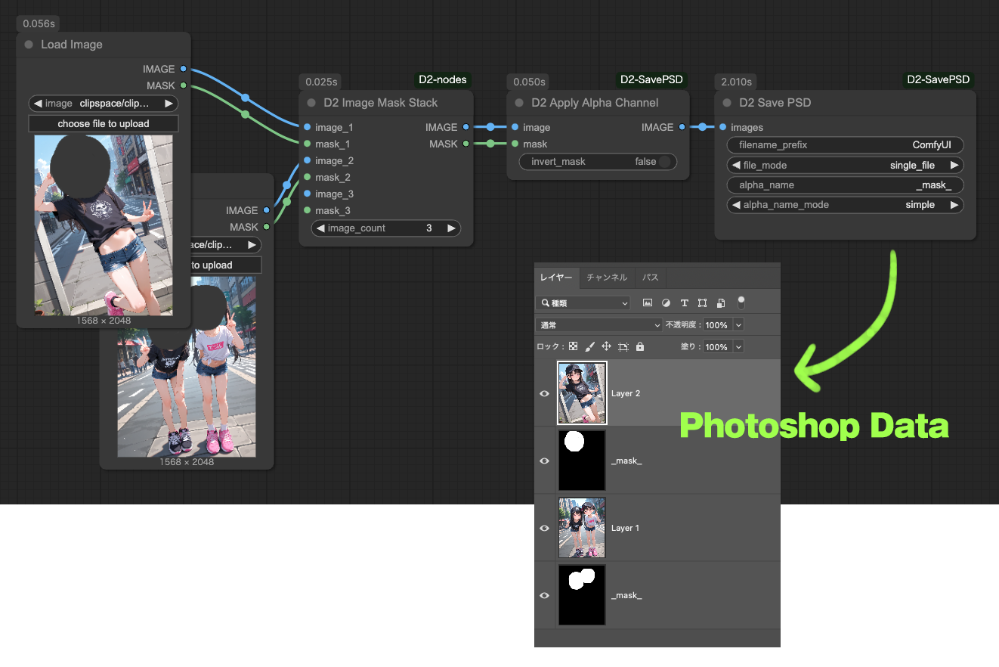
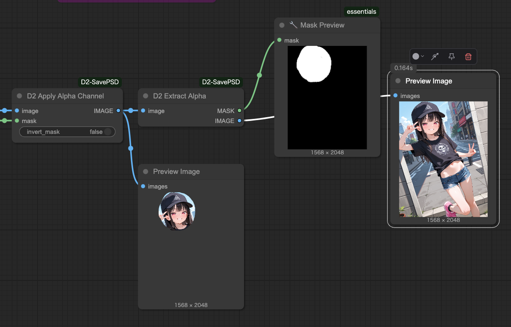
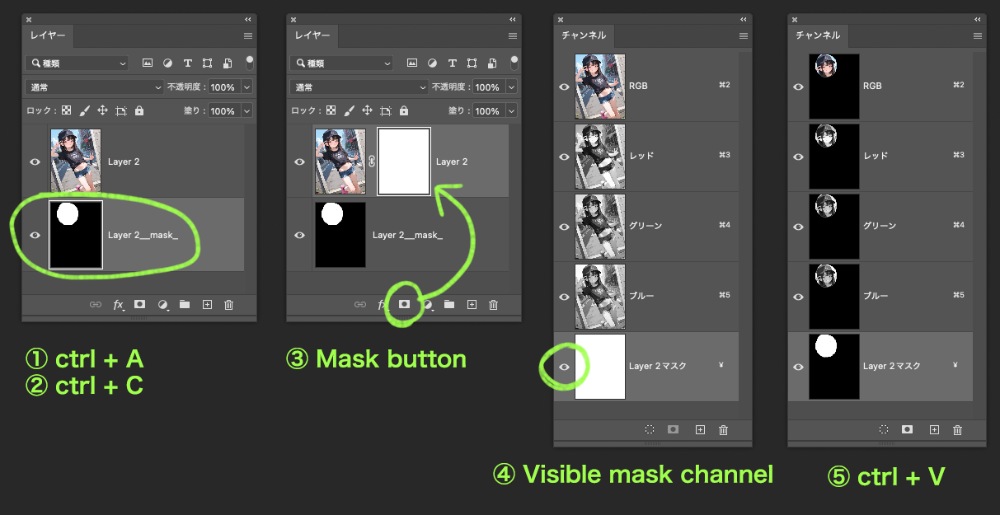

# D2 SavePSD ComfyUI

[<a href="README_en.md">English</a>][<a href="README.md">日本語</a>][<a href="README_zh.md">繁体中文</a>]

画像をPhotoshop形式（.psd）で保存するノードです。
アルファチャンネルの適用、分離なども可能です。

※レイヤーへのマスク適用は現時点（2025/04/07）では実装されていません。
アルファチャンネルは通常のレイヤーとして書き出されます。

<figure>

</figure>


---

## :card_index_dividers: Install

手動でインストールする方法

```shell
cd {ComfyUIインストールフォルダ}/custom_nodes
git clone https://github.com/da2el-ai/D2-SavePSD-ComfyUI.git
```

必要なライブラリをインストール
:exclamation: **ComfyUI Manager を使ってインストールした場合でも下記の手順は必要です。**

```shell
cd {ComfyUIインストールフォルダ}/custom_nodes/D2-SavePSD-ComfyUI
..\..\venv\Scripts\activate
python install.py
```


---

## :tomato: Nodes

### D2 Save PSD

<figure>

</figure>

- `images` で受け取った画像をPSD形式で保存する
- レイヤーマスクには対応していないので、アルファチャンネルは通常の画像レイヤーに変換される

### Input

- `filrename_prefix`
  - ファイル名のフォーマットです。標準の `Save Image` ノードと同じ書式が使えます。
- `file_mode`
  - 複数の画像を受け取った時の動作
  - `single_file`: １つのPSDにレイヤーとしてまとめる
  - `multi_file`: 画像ごとに個別のPSDファイルに保存する
- `alpha_name`
  - アルファチャンネルに付与するレイヤー名
  - 初期値: `_mask_`
- `alpha_name_mode`
  - アルファチャンネルレイヤーの名前の付け方
  - `simple`: `{alpha_name}`
  - `suffix`: `{画像レイヤー名}_{alpha_name}`

---

### D2 Apply Alpha Channel

<figure>

</figure>

- MASKをアルファチャンネルに適用する


---

### D2 Extract Alpha

<figure>

</figure>

- `D2 Apply Alpha Channel` で付与したアルファチャンネルを分離する
- 透過PNGなどからアルファチャンネルを分離することは出来ません


---

## :computer: レイヤーへのマスク適用について（手動）

<figure>

</figure>

- 下記はPhotoshopでの操作です。
- ここに書かれた方法以外にも色々な方法でマスクは作成できますので、好きな方法でお試しください。
- Photoshop以外のアプリでもたぶん可能です。
- **Photoshopの操作についての質問は受け付けていません。**

### 手順

1. マスクレイヤーを選択して全選択＞コピー
2. マスクを適用したいレイヤーを選択して、マスクボタンをクリック
3. チャンネルパレットでマスクチャンネルを表示する
4. マスクチャンネルにペーストする

---

## :computer: レイヤーへのマスク適用について（Photoshop Script）

- Photoshop Script を使って指定したフォルダの全ての画像についてマスクを適用します

### 前提条件

- Photoshop CC 2024
  - 他のバージョンでは動作確認をしていません
- `D2 Save PSD` の設定を `alpha_name_mode: simple` にして作成した画像
  - マスクレイヤーの名前が統一されていればOK

### 準備

スクリプトファイル <a href="./Photoshop script/d2_automask.jsx" target="_blank">d2_automask.jsx</a> を任意の場所に保存してください。

### 実行

1. 任意のフォルダにマスク適用したいPSDデータを置く
   - 関係ないファイルは置かないでください
2. Photoshopのメニュー `[ファイル > スクリプト > 参照]` を選択

<figure>

</figure>

3. 保存した `d2_automask.jsx` を選択
4. ダイアログが開くので、`入力フォルダ` に画像のあるフォルダを入力し、`実行` をクリック

<figure>

</figure>

5. マスクを適用した画像が出力される

### オプションについて

- `入力フォルダ`
  - 対象のPSDデータが置いてあるフォルダ
- `出力フォルダ`
  - 出力先のフォルダ。空欄の時は `入力フォルダ/output` に保存される
- `マスクレイヤー名`
  - 対象となるマスクレイヤーの名前。空欄の時は `_mask_` が適用される
- `マスクを反転する`
  - チェックしている時は選択範囲を反転してマスクする


---

## :blossom: 更新履歴

**2025.04.07**

- とりあえず作った

