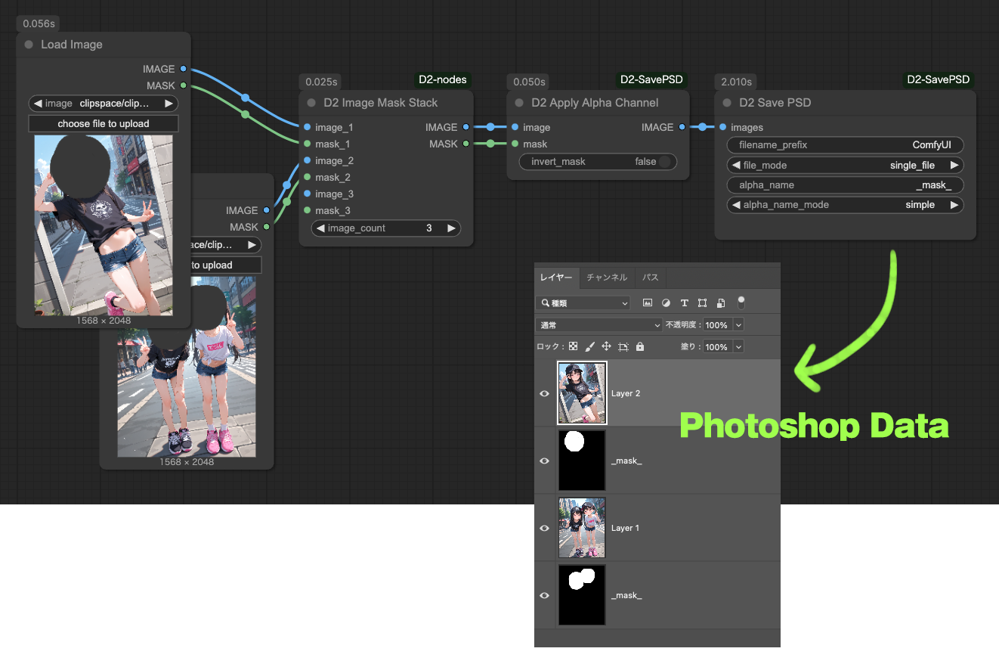
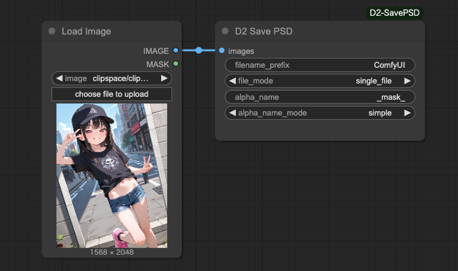
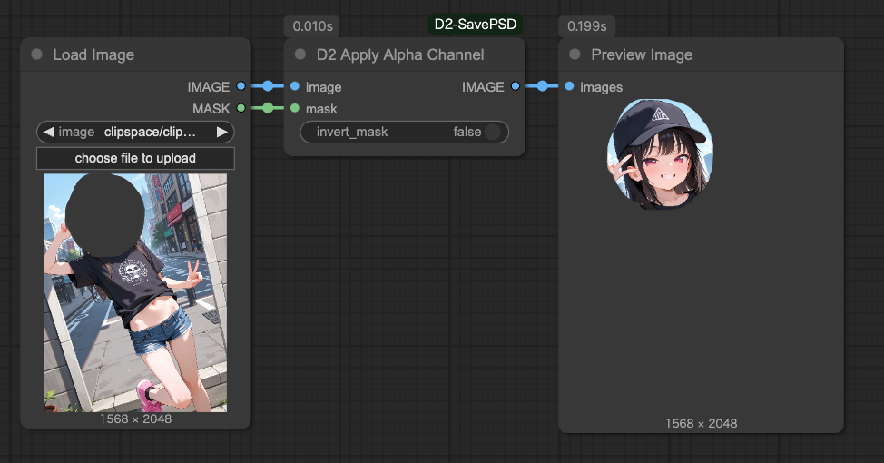
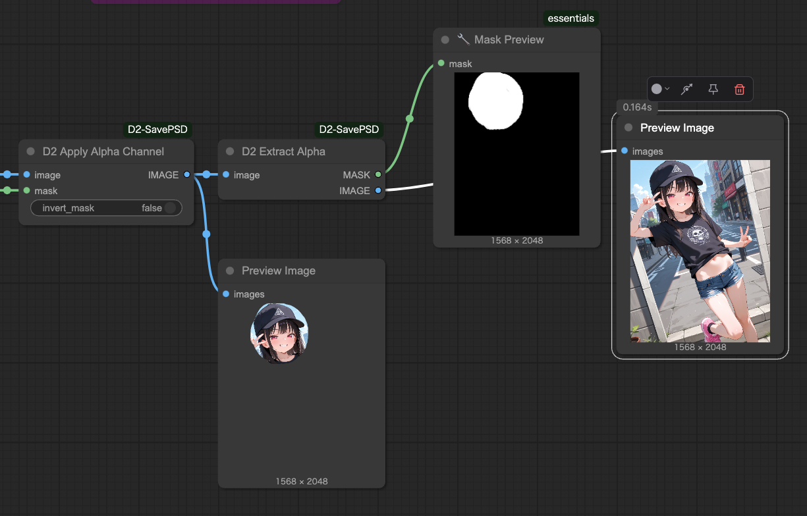
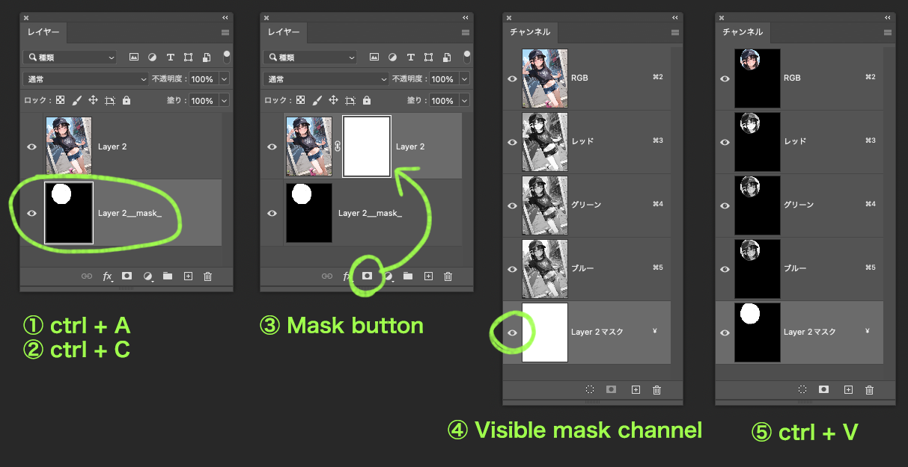
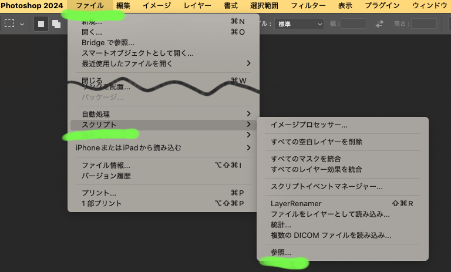
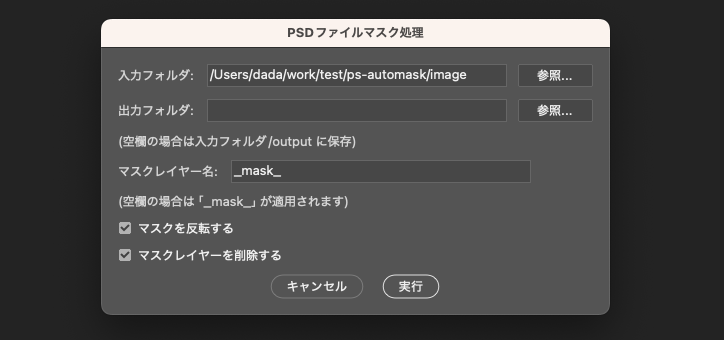

# D2 SavePSD ComfyUI

[<a href="README_en.md">English</a>][<a href="README.md">日本語</a>][<a href="README_zh.md">繁体中文</a>]

A node that saves images in Photoshop format (.psd).
Alpha channel application and separation are also possible.

*Note: Layer mask application is not implemented at this time (2025/04/07).
Alpha channels are exported as normal layers.

<figure>

</figure>


---

## :card_index_dividers: Install

Manual installation method

```shell
cd {ComfyUI installation folder}/custom_nodes
git clone https://github.com/da2el-ai/D2-SavePSD-ComfyUI.git
```

Install required libraries
:exclamation: **This step is necessary even if you installed using ComfyUI Manager.**

```shell
cd {ComfyUI installation folder}/custom_nodes/D2-SavePSD-ComfyUI
..\..\venv\Scripts\activate
python install.py
```


---

## :tomato: Nodes

### D2 Save PSD

<figure>

</figure>

- Saves images received via `images` in PSD format
- Layer masks are not supported, so alpha channels are converted to normal image layers

### Input

- `filrename_prefix`
  - File name format. The same format as the standard `Save Image` node can be used.
- `file_mode`
  - Behavior when receiving multiple images
  - `single_file`: Combine as layers into a single PSD
  - `multi_file`: Save each image to individual PSD files
- `alpha_name`
  - Layer name given to alpha channels
  - Default value: `_mask_`
- `alpha_name_mode`
  - Naming method for alpha channel layers
  - `simple`: `{alpha_name}`
  - `suffix`: `{image layer name}_{alpha_name}`

---

### D2 Apply Alpha Channel

<figure>

</figure>

- Apply MASK as an alpha channel


---

### D2 Extract Alpha

<figure>

</figure>

- Separate alpha channels applied with `D2 Apply Alpha Channel`
- Cannot separate alpha channels from transparent PNGs, etc.


---

## :computer: About Applying Masks to Layers (Manual)

<figure>

</figure>

- The following are operations in Photoshop.
- There are various other ways to create masks besides the methods described here, so please try your preferred method.
- Probably possible in applications other than Photoshop as well.
- **We do not accept questions about Photoshop operations.**

### Procedure

1. Select the mask layer, then Select All > Copy
2. Select the layer to which you want to apply the mask, then click the mask button
3. Display the mask channel in the Channels palette
4. Paste into the mask channel

---

## :computer: About Applying Masks to Layers (Photoshop Script)

- Applies masks to all images in a specified folder using a Photoshop Script

### Prerequisites

- Photoshop CC 2024
  - Not tested with other versions
- Images created with `D2 Save PSD` settings set to `alpha_name_mode: simple`
  - OK as long as mask layer names are unified

### Preparation

Save the script file <a href="./Photoshop script/d2_automask.jsx" target="_blank">d2_automask.jsx</a> to any location.

### Execution

1. Place the PSD data you want to apply masks to in any folder
   - Please do not place unrelated files
2. Select `[File > Scripts > Browse]` from the Photoshop menu

<figure>

</figure>

3. Select the saved `d2_automask.jsx`
4. A dialog will open, enter the folder with images in `入力フォルダ`, and click `実行`

<figure>

</figure>

5. Images with masks applied will be output

### About Options

- `入力フォルダ`
  - Folder where target PSD data is located
- `出力フォルダ`
  - Output destination folder. When blank, saved to `入力フォルダ/output`
- `マスクレイヤー名`
  - Name of the target mask layer. When blank, `_mask_` is applied
- `マスクを反転する`
  - When checked, inverts the selection and masks
- `マスクレイヤーを削除する`
  - Delete mask layers when saving files


---

## :blossom: Update History

**2025.04.09**

- PS Script: Added option to delete mask layers

**2025.04.07**

- Initially created