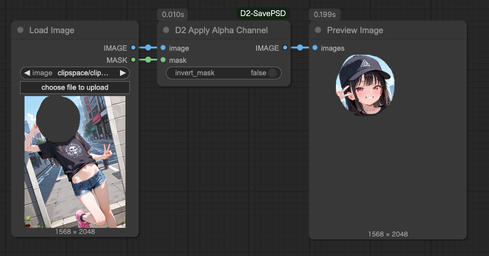

# D2 SavePSD ComfyUI

[<a href="README_en.md">English</a>][<a href="README.md">日本語</a>][<a href="README_zh.md">繁体中文</a>]

一個可以將圖像以Photoshop格式（.psd）保存的節點。
還支持應用和分離Alpha通道。

※目前（2025/04/07）尚未實現對圖層蒙版的應用。
Alpha通道會作為普通圖層導出。

<figure>

</figure>


---

## :card_index_dividers: 安裝

手動安裝方法

```shell
cd {ComfyUI安裝文件夾}/custom_nodes
git clone https://github.com/da2el-ai/D2-SavePSD-ComfyUI.git
```

安裝所需庫
:exclamation: **即使使用ComfyUI Manager安裝，也需要執行以下步驟。**

```shell
cd {ComfyUI安裝文件夾}/custom_nodes/D2-SavePSD-ComfyUI
..\..\venv\Scripts\activate
python install.py
```


---

## :tomato: 節點

### D2 Save PSD

<figure>

</figure>

- 將通過`images`接收的圖像以PSD格式保存
- 不支持圖層蒙版，因此Alpha通道會轉換為普通圖像圖層

### 輸入

- `filrename_prefix`
  - 文件名格式。可以使用與標準`Save Image`節點相同的格式。
- `file_mode`
  - 接收多個圖像時的行為
  - `single_file`: 將多個圖像作為圖層合併到一個PSD中
  - `multi_file`: 將每個圖像保存到單獨的PSD文件中
- `alpha_name`
  - 賦予Alpha通道的圖層名稱
  - 默認值: `_mask_`
- `alpha_name_mode`
  - Alpha通道圖層的命名方式
  - `simple`: `{alpha_name}`
  - `suffix`: `{圖像圖層名}_{alpha_name}`

---

### D2 Apply Alpha Channel

<figure>

</figure>

- 將MASK應用為Alpha通道


---

### D2 Extract Alpha

<figure>

</figure>

- 分離通過`D2 Apply Alpha Channel`添加的Alpha通道
- 無法從透明PNG等圖像中分離Alpha通道


---

## :computer: 關於將蒙版應用到圖層（手動）

<figure>

</figure>

- 以下是在Photoshop中的操作。
- 除了這裡描述的方法外，還有很多其他方法可以創建蒙版，請嘗試您喜歡的方法。
- 在Photoshop以外的應用程序中可能也適用。
- **我們不接受關於Photoshop操作的問題。**

### 步驟

1. 選擇蒙版圖層，然後全選>複製
2. 選擇要應用蒙版的圖層，然後點擊蒙版按鈕
3. 在通道面板中顯示蒙版通道
4. 將複製的內容貼到蒙版通道中

---

## :computer: 關於將蒙版應用到圖層（Photoshop腳本）

- 使用Photoshop腳本為指定文件夾中的所有圖像應用蒙版

### 前提條件

- Photoshop CC 2024
  - 未在其他版本上測試
- 使用`D2 Save PSD`設置為`alpha_name_mode: simple`創建的圖像
  - 只要蒙版圖層名稱統一即可

### 準備

將腳本文件<a href="./Photoshop script/d2_automask.jsx" target="_blank">d2_automask.jsx</a>保存到任意位置。

### 執行

1. 在任意文件夾中放置想要應用蒙版的PSD數據
   - 請不要放置無關文件
2. 從Photoshop菜單中選擇`[文件 > 腳本 > 瀏覽]`

<figure>

</figure>

3. 選擇保存的`d2_automask.jsx`
4. 對話框打開後，在`入力フォルダ`中輸入圖像所在的文件夾，然後點擊`実行`

<figure>

</figure>

5. 應用了蒙版的圖像將被輸出

### 關於選項

- `入力フォルダ`
  - 目標PSD數據所在的文件夾
- `出力フォルダ`
  - 輸出目的地文件夾。為空時，保存到`入力フォルダ/output`
- `マスクレイヤー名`
  - 目標蒙版圖層的名稱。為空時，應用`_mask_`
- `マスクを反転する`
  - 勾選時，反轉選擇並進行蒙版
- `マスクレイヤーを削除する`
  - 儲存檔案時刪除遮罩圖層


---

## :blossom: 更新歷史

**2025.04.09**

- PS 腳本：新增刪除遮罩圖層的選項

**2025.04.07**

- 初步創建